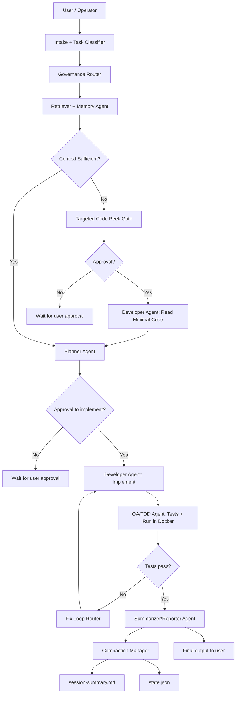
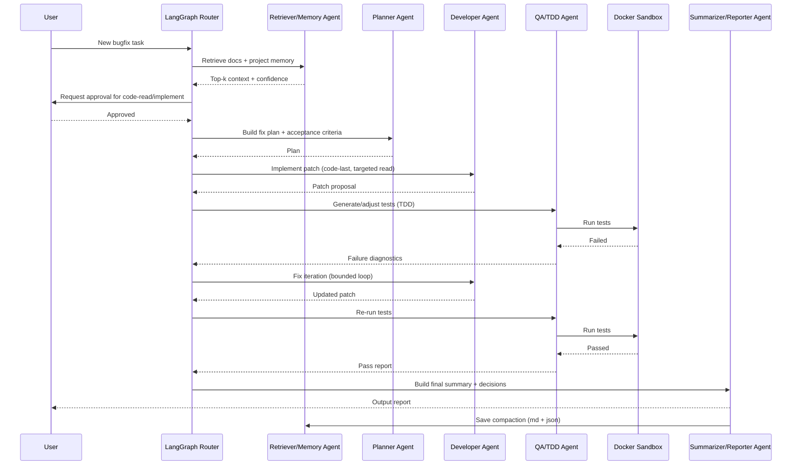

# Архитектура мультиагентной системы (локально): `llama.cpp` + `Qwen` + `LangGraph`

## 1) Цель системы

Спроектировать локальную мультиагентную систему для backend-разработчика, которая:

- работает полностью локально (без обязательных внешних API);
- умеет планировать, писать код, фиксить баги, запускать TDD-цикл;
- использует RAG и проектную память как первичный источник контекста;
- читает код репозитория только на поздних стадиях (RAG-first, code-last);
- поддерживает контролируемый режим выполнения с ручными approval;
- оптимизирована под устройство с `~16 GB RAM`.

---

## 2) Зафиксированные требования

### 2.1 Функциональные

- Языки/стек: `Java`, `Kotlin`, `Spring`, `React`.
- Агент должен уметь:
  - декомпозировать задачу и планировать работу;
  - выполнять изменения в коде;
  - чинить баги;
  - работать по TDD-подходу (tests-first/requirements-first);
  - формировать отчет о проделанной работе в конце цикла.
- Источники знаний для RAG:
  - проектные документы в `md`;
  - накопленная проектная память;
  - (опционально) индекс репозитория.

### 2.2 Нефункциональные

- Режим: локальный, quality-first.
- Выполнение: последовательное (без обязательной параллельной мультизадачности).
- Изоляция: `Docker sandbox` достаточно.
- Агент по умолчанию ждет approval перед критичными действиями.

### 2.3 Управление контекстом

- Основная модель: `Qwen2.5-Coder 14B` (локально).
- Компактизация контекста: гибрид `A+B+D`:
  - `A`: автокомпактизация при `75%` заполнения контекстного окна;
  - `B`: после завершения этапа (`plan`, `implement`, `test`, `fix`);
  - `D`: вручную по команде пользователя.
- Формат сохранения памяти сессии: `md + json`.

---

## 3) Выбранный стек и обоснование

## 3.1 LLM: `Qwen` (основной профиль 14B + fallback 7B)

Почему:

- сильные результаты в задачах кодогенерации и reasoning;
- хорошая практическая применимость для `Java/Kotlin/Spring/React`;
- есть рабочие квантованные варианты под локальный запуск;
- есть fallback на 7B для ускорения рутинных шагов.

Рекомендуемый профиль:

- Primary: `Qwen2.5-Coder 14B` (Q4_K_M);
- Fallback: `Qwen2.5-Coder 7B` (Q4_K_M);
- режим переключения:
  - 14B для архитектуры, сложных фиксов, ревью и спорных решений;
  - 7B для простых переформулировок, шаблонного кода, быстрых промежуточных шагов.

## 3.2 Inference engine: `llama.cpp`

Почему:

- оптимален для локального CPU-first запуска GGUF на ограниченной памяти;
- дает тонкий контроль (квантование, контекст, батчинг, параметры генерации);
- меньше накладных расходов, чем тяжелые серверные GPU-решения;
- лучше подходит для ноутбука без NVIDIA CUDA.

Ограничения:

- ниже throughput по сравнению с GPU-серверами;
- нужен аккуратный контроль контекста и KV-cache.

## 3.3 Оркестрация: `LangGraph`

Почему:

- удобен для stateful workflow и явных переходов между этапами;
- легко внедрить human-in-the-loop approval гейты;
- хорошо ложится на инженерный pipeline: `plan -> approve -> implement -> test -> fix -> report`;
- поддерживает memory/checkpoint-подход и трассируемость решений.

## 3.4 Дополнительные библиотеки/фреймворки (выбраны сразу)

Ниже 4 дополнительные технологии, включая обязательные `SuperMemory` и `RAGFlow`:

1. **`SuperMemory`** (проектная долговременная память)
   - хранение устойчивых знаний по проекту и истории решений;
   - удобно как memory API-слой между агентами и хранилищем;
   - усиливает повторное использование знаний между задачами.

2. **`RAGFlow`** (RAG-пайплайн и качество retrieval)
   - ingestion, retrieval и explainable citations в едином контуре;
   - подходит для режима `RAG-first` с контролем источников;
   - снижает риск "слепого" code-read и повышает трассируемость ответов.

3. **`LlamaIndex`** (data framework для индексации/ретривала)
   - коннекторы к данным, гибкие retriever/query-паттерны;
   - удобно как слой оркестрации данных поверх `md`-доков и project artifacts;
   - можно использовать как fallback/расширение retrieval поверх RAGFlow.

4. **`Langfuse`** (observability/evals для LLM-пайплайна)
   - трейсинг шагов агента, токенов, latency и ошибок;
   - помогает оценивать quality drift и эффективность роутинга;
   - упрощает защиту архитектуры фактами по метрикам.

Почему именно такой набор:

- `LangGraph` решает оркестрацию и роутинг;
- `RAGFlow + LlamaIndex` закрывают retrieval/data-plane;
- `SuperMemory` закрывает memory-plane;
- `Langfuse` закрывает измеримость и наблюдаемость.

---

## 4) Логическая архитектура (C4: Container-level)

## 4.1 Контейнеры/модули

1. **UI/CLI слой (Operator Console)**
   - постановка задач;
   - approvals;
   - просмотр артефактов (план, diff, тесты, отчеты).

2. **LangGraph Orchestrator**
   - выполнение графа состояний;
   - маршрутизация между агентами;
   - политика остановок и approval.

3. **Agent Pool (роли)**
   - Planner Agent;
   - Developer Agent;
   - QA/TDD Agent;
   - Retriever/Memory Agent;
   - Summarizer/Reporter Agent.

4. **Inference Runtime (`llama.cpp`)**
   - запуск Qwen-моделей;
   - primary/fallback переключение.

5. **RAG + Memory Subsystem**
   - индекс `md`-документов;
   - хранилище проектной памяти;
   - ранжирование и компрессия релевантного контекста.

6. **Code Workspace Adapter**
   - доступ к репозиторию;
   - ограниченное чтение кода по policy (late-read);
   - запись изменений в sandbox.

7. **Docker Sandbox**
   - безопасный запуск сборок, тестов, линтеров;
   - ограничение побочных эффектов.

8. **Observability Stack**
   - метрики, логи, трейсы, алерты;
   - дашборды по качеству retrieval и этапам графа.

---

## 5) Мультиагентная топология и роли

## 5.1 Почему это именно мультиагентная система (а не набор изолированных ботов)

- Единый оркестратор (`LangGraph`) управляет ролями в одном workflow.
- Есть общий контур памяти и общий state выполнения задачи.
- Есть роутинг: каждый шаг передается специализированному агенту в зависимости от этапа.
- Есть общие policy-гейты (approval, compaction, late-code-read).

## 5.2 Роли

### `Planner Agent`
- формирует план решения;
- выделяет критерии приемки;
- определяет тестовую стратегию (TDD).

### `Retriever/Memory Agent`
- извлекает контекст из RAG (md + memory);
- собирает минимальный рабочий контекст;
- контролирует качество retrieval.

### `Developer Agent`
- готовит патчи/изменения;
- читает код только после прохождения RAG-first фазы и approval.

### `QA/TDD Agent`
- формирует/обновляет тесты по требованиям задачи;
- запускает тесты в sandbox;
- анализирует причины падений.

### `Summarizer/Reporter Agent`
- делает compact summary;
- сохраняет `session-summary.md` и `state.json`;
- формирует user-facing output.

## 5.3 Как агенты объединены в одну систему с роутингом

Система использует **централизованный роутинг** через `LangGraph Router Node`, а не разрозненные независимые агенты.

### Логика роутинга

1. `Intake/Classifier Node`
   - классифицирует задачу: `feature`, `bugfix`, `refactor`, `analysis`;
   - определяет приоритет и обязательные гейты (`approval`, `test`).

2. `Context Router Node`
   - всегда отправляет в `Retriever/Memory Agent` первым (`RAG-first`);
   - после retrieval решает, хватает ли контекста или нужен `targeted code peek`.

3. `Execution Router Node`
   - направляет в `Planner` -> `Developer` -> `QA/TDD`;
   - при падении тестов отправляет в цикл `Fix Loop` (`Developer <-> QA`) до лимита попыток.

4. `Governance Router Node`
   - проверяет policy-гейты:
     - approval gate;
     - code-read разрешен только после RAG-фазы;
     - compaction gate при 75% или после этапа.

5. `Exit Router Node`
   - если критерии выполнены -> `Summarizer/Reporter`;
   - если нет -> возврат на нужный этап с записью причины в память.

### Оркестрационный pattern

- Базовый режим: **orchestrator-worker** (центральный контроллер + специализированные воркеры).
- Для test/fix используется **bounded iterative loop** с guard-условиями:
  - max retries;
  - max token budget;
  - error budget threshold.

Это гарантирует, что агенты не "живут отдельно", а работают как единая управляемая мультиагентная система с явным роутингом и правилами переходов.

---

## 6) Политика контекста: `RAG-first, code-last`

## 6.1 Принцип

Перед чтением кода агент обязан:

1. сделать retrieval из RAG (docs + project memory);
2. сформировать гипотезу решения;
3. запросить approval на переход к этапу code-read.

Только после этого разрешается целевое чтение минимально нужных файлов.

## 6.2 Что это дает

- меньше лишних токенов;
- выше предсказуемость reasoning;
- больше независимости от текущей структуры репозитория;
- удобнее масштабировать на несколько проектов с похожей доменной памятью.

## 6.3 Риски и контроль

- риск устаревшей памяти -> mitigation: freshness score + ссылки на источники;
- риск неполного контекста -> mitigation: targeted code peek на узком наборе файлов;
- риск галлюцинаций -> mitigation: обязательная верификация тестами и проверками.

---

## 7) Система памяти и компактизации

## 7.1 Краткосрочная память (working memory)

- текущий state графа;
- активные гипотезы;
- открытые риски;
- текущий план итерации.

## 7.2 Долгосрочная проектная память

- ключевые архитектурные решения;
- прошлые фиксы и причины;
- контракты API и соглашения по проекту;
- устойчивые правила кодовой базы.

## 7.3 Формат хранения

- `session-summary.md` — человекочитаемая выжимка;
- `state.json` — машиночитаемое восстановление контекста.

## 7.4 Алгоритм compaction (`A+B+D`)

Триггеры:

- при 75% контекстного окна;
- после каждого этапа pipeline;
- по ручной команде пользователя.

Шаги:

1. выделение обязательных фактов (goal, constraints, decisions, unresolved items);
2. формирование компактной версии контекста;
3. запись в `md + json`;
4. очистка активного контекста модели;
5. восстановление в следующий цикл только минимально необходимого блока.

---

## 8) Изоляция исполнения: Docker sandbox

## 8.1 Почему Docker релевантен

- воспроизводимая среда для билдов/тестов;
- ограничение доступа к хосту;
- удобный контроль зависимостей и версий;
- соответствует требованию изоляции без избыточной сложности VM.

## 8.2 Минимальные меры безопасности

- запуск контейнеров с ограниченными правами;
- read-only mount для чувствительных директорий;
- ограничение сети по policy;
- лимиты CPU/RAM;
- отдельные volumes под временные артефакты.

---

## 9) Evals и метрики качества

## 9.1 Метрики LLM/агента

- `Test Pass Rate` (основная);
- `Coverage` по релевантным модулям (не только глобальный %);
- `Requirement-to-Test Traceability` (каждому требованию соответствует тест);
- `Tool Success Rate`;
- `Retrieval Quality` (precision@k / экспертная релевантность);
- `Hallucination Rate` (ошибочные факты/ложные ссылки на код);
- `Latency` по этапам;
- `Token Usage` на задачу и на этап;
- `Error Budget` (допустимая доля неуспешных прогонов).

## 9.2 TDD-контур оценки

Для каждого task-run:

1. формулировка критериев приемки;
2. генерация/обновление тестов;
3. fail-first прогон;
4. реализация;
5. green-run;
6. рефакторинг без нарушения тестов.

Успех run-а фиксируется только при:

- прохождении тестов;
- соответствии тестов требованиям;
- отсутствии критических регрессий.

---

## 10) Observability (метрики + логи + трейсы + алерты)

## 10.1 Что мониторить

- latency по узлам графа и по задаче в целом;
- token usage (prompt/completion, по ролям/этапам);
- tool success/failure;
- retrieval quality и источник контекста;
- hallucination signals;
- error budget burn rate.

## 10.2 Логи

- structured JSON logs (trace_id, task_id, stage, agent_role, tool, outcome);
- отдельные логи решений (decision log) и approvals.

## 10.3 Трейсы

- end-to-end trace на каждый run;
- span на каждый узел LangGraph;
- связь LLM-вызовов, tool-вызовов и тестовых прогонов.

## 10.4 Алертинг

- рост failure rate инструментов;
- деградация retrieval quality;
- превышение token budget;
- рост latency сверх SLA;
- превышение error budget.

---

## 11) Режимы работы агента (policy)

### `Safe/Approval Mode` (по умолчанию)
- каждое критичное действие подтверждается пользователем;
- запись всех промежуточных решений в память.

### `Semi-Auto Mode`
- автоматические переходы внутри этапа;
- approval на границах этапов.

### `Auto Mode` (опционально)
- полный цикл без ручных подтверждений;
- применим только при доверии к eval-профилю и sandbox-ограничениях.

---

## 12) Почему выбранная архитектура оптимальна под `16 GB RAM`

- Модель 14B в квантованном виде реальна для локального CPU-first запуска.
- Политика compaction снижает риск OOM и деградации по latency.
- RAG-first уменьшает “слепое” чтение больших файлов и расход токенов.
- Fallback на 7B сохраняет отзывчивость для рутинных операций.
- Docker sandbox обеспечивает безопасность без стоимости VM-оркестрации.
- LangGraph дает управляемость и защищаемую архитектурную строгость.

---

## 13) Ограничения и план улучшений

Ограничения:

- 14B на CPU может быть заметно медленным на длинных сессиях;
- качество retrieval зависит от дисциплины индексирования docs;
- без аккуратных eval-процедур сложно стабилизировать hallucination rate.

Улучшения:

- гибридный reranker для retrieval;
- адаптивное переключение 14B/7B по сложности шага;
- расширенный memory governance (TTL, confidence, source lineage);
- автоматическая валидация “требование -> тест -> результат”.

---

## 14) Итоговое решение

Рекомендуемая архитектурная связка:

- **LLM:** `Qwen2.5-Coder 14B` (primary) + `Qwen2.5-Coder 7B` (fallback)
- **Inference:** `llama.cpp`
- **Orchestration:** `LangGraph`
- **Additional stack:** `SuperMemory + RAGFlow + LlamaIndex + Langfuse`
- **Context Strategy:** `RAG-first, code-last`
- **Memory:** `session-summary.md + state.json`
- **Compaction:** `75% + after-stage + manual`
- **Isolation:** `Docker sandbox`
- **Quality Gate:** `TDD + test pass + coverage + traceability`
- **Observability:** `latency/tokens/tools/retrieval/hallucinations/error-budget`

Это решение соответствует требованиям задания, реалистично под аппаратные ограничения и хорошо защищается на устной презентации по критериям выбора, рискам и trade-offs.

---

## 15) Диаграммы взаимодействия (Flow + Sequence)

## 15.1 Flow (Mermaid): взаимосвязь агентов и роутинг

## 15.2 Sequence (Mermaid): сценарий `bugfix`

## 15.3 Implementation status (MVP in repo)

Реализовано в текущем репозитории:

- `LangGraph`-совместимый workflow с роутингом: classify -> governance -> retrieve -> context_gate -> code_peek -> plan -> implement -> test -> fix_router -> report.
- Политики:
  - approval gate;
  - `RAG-first, code-last`;
  - compaction триггеры (`75%`, after-stage, manual).
- Гибридный retrieval слой:
  - `RAGFlow` (опционально, по флагу);
  - `SuperMemory` search (опционально, по флагу);
  - fallback на локальный markdown-index.
  - локальный retrieval: BM25 + лёгкий semantic-proxy + узкий rerank (настраивается профилями в `profiles/*.yaml`).
- Память:
  - `session-summary.md`;
  - `state.json`;
  - sync summary в `SuperMemory` (если включен).
- Sandbox:
  - Docker test runner (опционально, по флагу).
- Observability:
  - JSONL events для этапов/ролей/успеха/токенов.

Профили для аккуратной памяти на ноутбуке:

- `profiles/index.yaml` — режим индексации (стабильный candidate pool).
- `profiles/agent.yaml` — режим запуска агента (rerank funnel).

Что еще нужно для production-уровня:

- подключить реальные API-ключи/контракты `RAGFlow` и `SuperMemory`;
- добавить полноценные eval-сценарии и quality gates в CI;
- расширить test execution под Java/Kotlin/Spring/React пайплайны;
- усилить retrieval quality метриками (precision/recall/groundedness) и алертингом.
